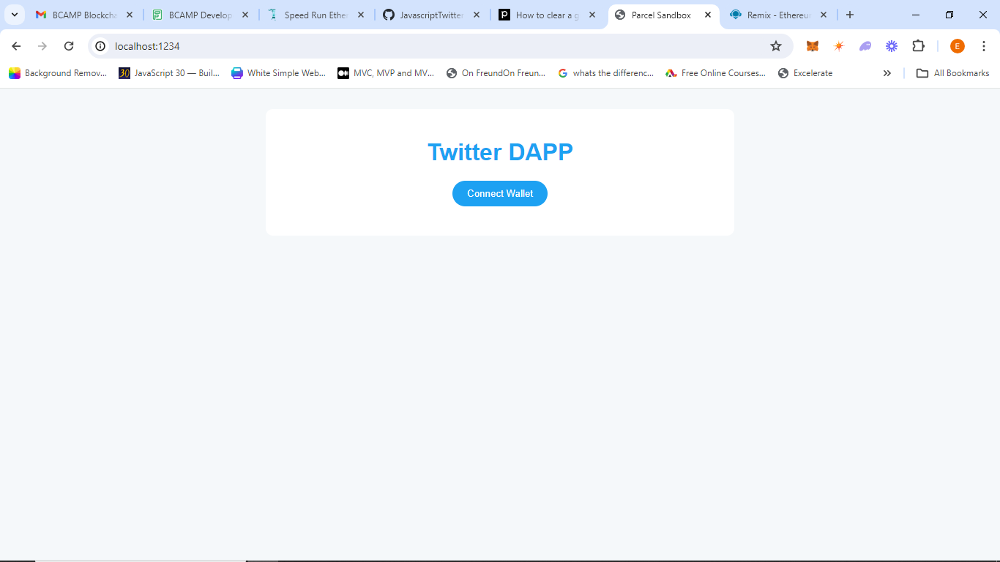
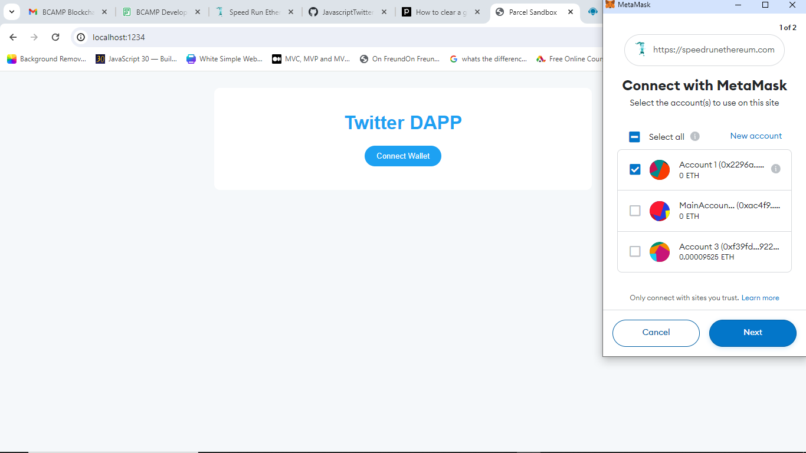
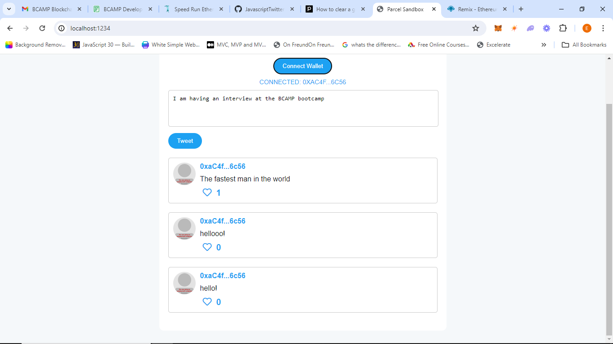
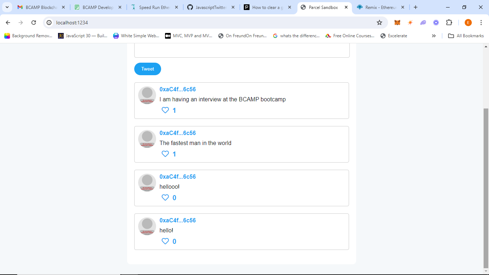

# Javascript Twitter Dapp

**Running Your Twitter Dapp Using NPM**
1. Kindly open the cloned file with vscode.
2. Go to the terminal option on the vscode ide enviroment and click new terminal.
3. Kindly Run the command `npm i` on powerhsell or the provided commandline.
4. Once the necessary packages are installed, type the command `npm start`
5. Boom💥 You have your 🐤 Twitter Dapp Running.

**Using the DApp**

*Note: This a decentralized application, you can only interact with it if you have a wallet*

1. Kindly make sure you set your metamsk externsion, create a wallet and don't share your private key.
2. To interact with the contract, you need to have some <b>sepoliaEth<b>. I recommend getting your sepoliaEth from chainlink https://faucet.chain.link.
3. Time to interact with the contract😀.

The following images describes the stages of interaction with the contract.

Loading the Dapp
- 

Connecting the Metamask Wallet
- 

Interacting with the Dapp
- 

Writing your Tweet to the Blockchain
- 

*Note: you can also like your tweets as well by pressing the <b>like<b>😍 button*

# Have Fun!!!!